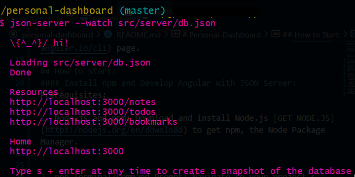
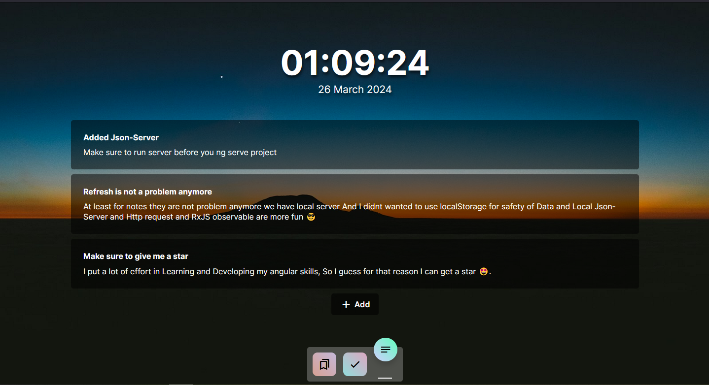

# Personal-Dashboard

This project was generated with [Angular CLI](https://github.com/angular/angular-cli) version 17.2.3.

## Development server

Run `ng serve` for a dev server. Navigate to `http://localhost:4200/`. The application will automatically reload if you change any of the source files.

## Build

Run `ng build` to build the project. The build artifacts will be stored in the `dist/` directory.

## Further help with Angular

To get more help on the Angular CLI use `ng help` or go check out the [Angular CLI Overview and Command Reference](https://angular.io/cli) page.

## How to Start:

#### Install npm and Develop Angular with JSON Server:

Prerequisites:

1.  Node.js and npm: Download and install Node.js [GET NODE.JS](https:/nodejs.org/en/download) to get npm, the Node Package Manager.

2.  pen Terminal/Command Prompt: Navigate to your project's root directory using the terminal or command prompt.

3.  Install Angular CLI (globally):

        npm install -g @angular/cli

4.  Clone this repo:

        git clone git@github.com:Poya-Faraji/personal-dashboard.git

5.  Enter Project folder:

        cd personal-dashboard

6.  Install Packages

        npm install

7.  Run Angular using cli

            ng serve --open

8.  In Brand new terminal run this command to run json-server to be able to use local datababse make sure it is on port 3000

        json-server -- wathc src/server/db.json --port 3000

## Go to your browser and enjoy! 👌

### Dont forget to Give this repo a star ⭐

### You can reach out to me :

🟦 [Linkden](https://www.linkedin.com/in/poya-faraji/)
